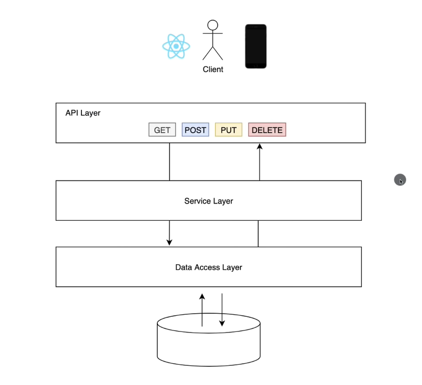
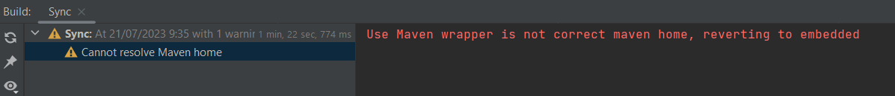
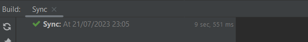
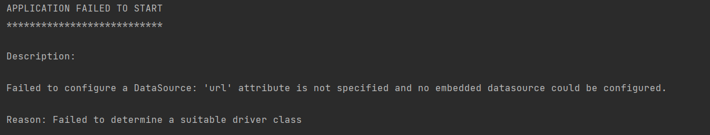
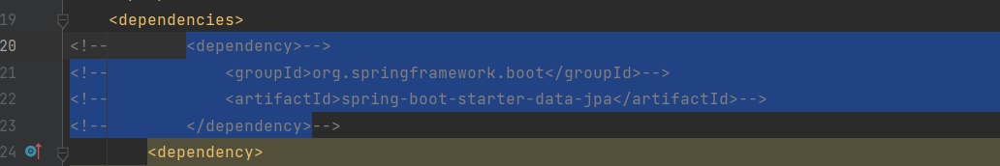
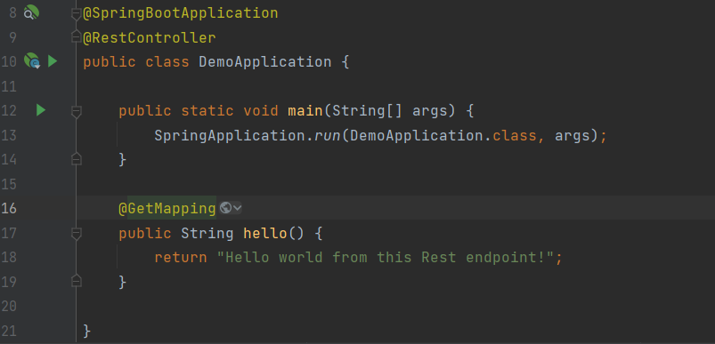
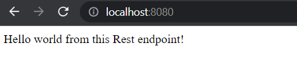

# Spring Boot Tutorial - Full Course

https://www.youtube.com/watch?v=9SGDpanrc8U&ab_channel=Amigoscode

## Introducción

## Spring Initilizr

Características:
- Java 17
- Maven
- Spring Boot 3.1.2 
- JAR (packaging)
- Dependencies:
  - Spring Web
  - Spring Data JPA
  - PostgreSQL Driver

## IntelliJ

**Error: Cannot resolve Maven Home**

Encontramos documentado este mismo error en [este foro](https://youtrack.jetbrains.com/issue/IDEA-300044). Pero hasta el momento no le han dado solución.

Con este error nos dimos cuenta de que, a pesar de que hemos creado y desarrollado muchos proyectos usando Maven, no lo teníamos instalado. ¿Cómo es esto posible?

**Solución**

Solamente faltaba especificar la variable de entorno JAVA_HOME. En nuestro caso, usamos el JDK 17, y la ruta es _C:\Program Files\Java\jdk-17.0.1_

Seguimos trabajando en IntelliJ, y ahora corremos la aplicación de ejemplo que vino con Spring. Nos sale un error que esperabamos:

Este error nos sale porque tenemos una dependencia que espera encontrar la instanciación de DataSource, que sirve para conectarse a una base de datos.

Ya comentada esta dependencia, la aplicación Spring ya se contruye y el programa corre.

## API simple

El problema es que no hemos definido ningún enpoint, así que al conectarnos en un navegador al localhost, nos sale un error.

Nos faltan solo un par de cositas para tener una API con la mínima funcionalidad:

Con la etiqueta `@RestController` convertimos a DemoApplication en una clase que controla endpoints Rest, y con `@GetMapping` definimos establecemos nuestro primer endpoint, desde el cual se puede servir un servicio. En este caso el servicio es emitir una cadena:

## Clase Student