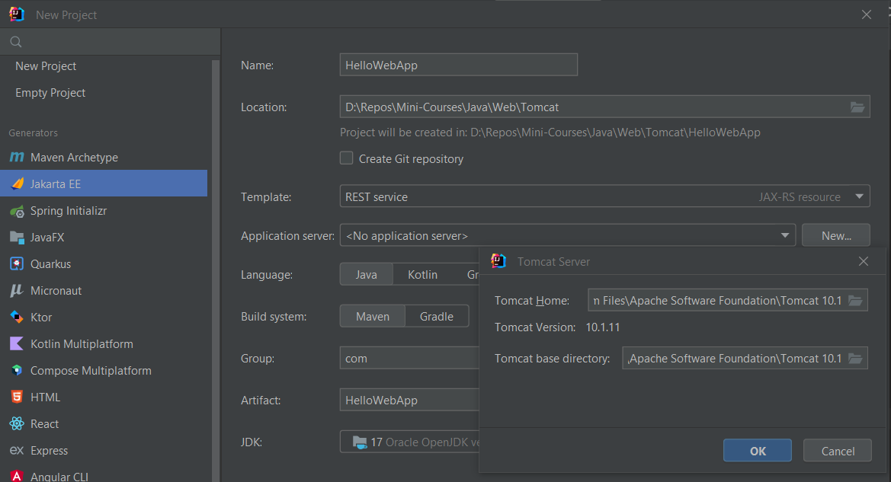
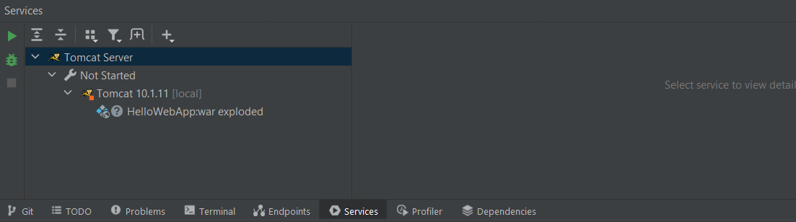
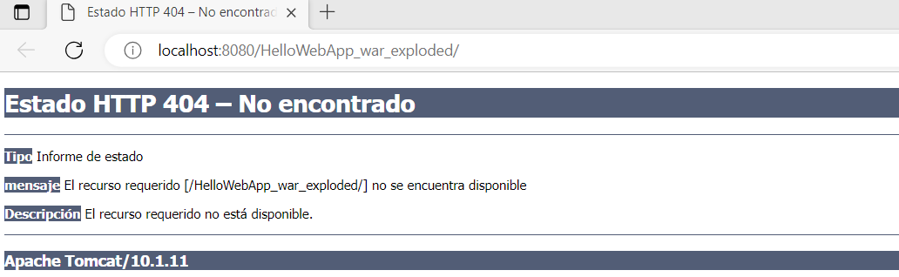
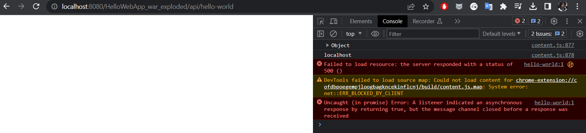
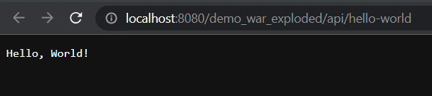

# Web App with Tomcat in InjtelliJ IDEA

https://www.youtube.com/watch?v=ThBw3WBTw9Q&pp=ygUPaW50ZWxsaWogdG9tY2F0

**Problemas**

En Windows, luego de instalar Tomcat, creamos un proyecto con Java Enterprise (Jakarta EE) y seleccionamos 

En IntelliJ, el servidor Tomcat se encuentra en la pestaña de servicios.

Le damos clic derecho en el servidor y luego a Run. Se abrirá automáticamente la siguiente ventana en el navegador principal:

No funciona

**¿Cómo lo solucionamos?**

Nosotros estabamos usando Tomcat 10.1.11, pero en el video usan Tomcat 10.0.16. Según [este foro](https://stackoverflow.com/questions/71375427/jersey-servlet-version-issues-java-lang-nosuchmethoderror-jakarta-httpservlet), de la versión 10.0 a la 10.1 hay varios cambios en cuanto a las dependencias que se usan: Servlet 5.0 a 6.0, 
Jersey 3.0 a 3.1, etc. Hicimos todos estos cambios, pero fue inútil. La solución fue usar la versión de Tomcat que se usa en el video y no actualizar nada.

