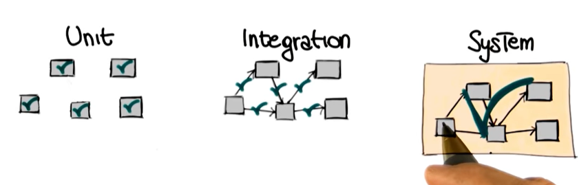

# Proceso de Desarrollo de Software <!-- omit in toc -->

Este curso está disponible como una [lista de reproducción](https://www.youtube.com/playlist?list=PLAwxTw4SYaPkNAtqsKcFkUGpf4j67NBaz) en el canal de YouTube de Udacity. Aquí solo vamos a abarcar los primeros 43 videos.

- [Introducción](#introducción)
  - [¿Qué es la ingeniería de software y por qué es importante?](#qué-es-la-ingeniería-de-software-y-por-qué-es-importante)
  - [¿Por qué es tan difícil desarrollar buen software?](#por-qué-es-tan-difícil-desarrollar-buen-software)
  - [Crisis y nacimiento](#crisis-y-nacimiento)
- [Proceso de software](#proceso-de-software)
  - [Fases tradicionales del software](#fases-tradicionales-del-software)
  - [Modelos de proceso de software](#modelos-de-proceso-de-software)
    - [Cuatro opciones de modelos](#cuatro-opciones-de-modelos)
    - [¿Cómo elegir el modelo de desarrollo correcto?](#cómo-elegir-el-modelo-de-desarrollo-correcto)

## Introducción

### ¿Qué es la ingeniería de software y por qué es importante?

Podríamos hacernos una pregunta previa: ¿qué son las computadoras? Las computadoras son dispositivos que están por todas partes y han cambiado mundo en el que vivimos. Pero casi todo el valor que aportan viene de cómo están programadas para respondera nuestras necesidades. En resumen, la programación hace posible que las computadoras generen valor.

La ingeniería de software es la disciplina que estudia cómo hacer que el proceso de programación sea eficiente y entregue productos de software confiables y de calidad. Este objetivo va más allá del código: implica cosas como saber trabajar en equipo, pensar en la arquitectura que le va a dar forma al software, o anticipar y mitigar los riesgos asociados al producto de software que se está construyendo.

¿Por qué la ingeniería de software es importante? Esto es lo mismo que preguntarnos lo siguiente: ¿Qué podría pasar si no aplicamos la ingeniería al desarrollo de software? La ingeniría de software es importante porque aumenta la vida útil del producto de software. Una buena ingeniería evita que las cosas se romperá fácilmente. También es importante porque, en algunos casos, los riesgos asociados al producto de software pueden hacer perder millones o quebrar una empresa, e incluso acabar con la vida de alguien. Una mala ingeniería puede pasar por alto estos riesgos.

|  |
|:---:|
| Representación de la explosión del cohete Ariane 5 debido a errores en el software. |

Un pequeño error en el código del Ariane 5 echo por la borda 10 años de trabajo conjunto de cientos de personas y 7 mil millones de dolares. Todo porque no existían métodos para probar el softare que ahora son básicos en la ingeniría de software, como las pruebas unitarias.

### ¿Por qué es tan difícil desarrollar buen software?

La ingeniería de software contempla un conjunto de metodologías, técnicas y herramientas que permiten crear software de calidad que satisface a los clientes y usuarios haciendo lo que se supone que debe hacer y que está dentro de los límites establecidos de tiempo y dinero.

### Crisis y nacimiento

El siguiente gráfico muestra el despilfarro de dinero que representaba desarrollar software. El estudio se realizó basado en nueve contratos que en total sumaban 7 millones. El problema es que estaban quemando 5 de esos 7 millones en desarrollar software que o bien no se lanzaba, o bien se lanzaba pero nunca se usaba.

Pero las empresas de este estudio no eran las únicas afectadas. La industria completa de desarrollo de software estaba en crisis, desangrándose. ¿Y por qué sucedía esto? Por la complejidad cada vez mayor del software requerido y la incapacidad de hacerle frente.

Esta crisis (que en realidad ocurrió varios años antes que el estudio de Davis de 1990) fue el caldo de cultivo para que naciera la ingeniería de software como disciplina. El nacimiento oficial se da en 1969, cuando varios expertos se reunieron en la conferencia NATO Software Engineering para definir y dar a conocer las mejores prácticas que habían para el desarrollo de software.

## Proceso de software

En esencia, el desarrollo de software es ir de la idea abstracta que alguien tiene en la cabeza (p. e. el cliente) a un sistema concreto que implementa la idea. 

Ahora, puede que la idea termine siendo implementada bien o puede que no. Después de todo, se trata de una tarea demasiado compleja. Por eso se debe manejar como un proceso que consta de múltiples partes o actividades. Un proceso sistemático y formal, como toda ingeniería, que no colapse frente a la complejidad. 

Este es el proceso de software, y hay varios.

### Fases tradicionales del software

La ingeniería de software es un *proceso* sistemático en el que se usan métodologías, técnicas y herramientas para crear buen software dentro de unos límites razonables de tiempo y dinero.

Ahora vamos a enfocarnos en las fases o actividades principales de este proceso:

1. Ingeniería de requisitos
2. Diseño
3. Implementación
4. Verificación y validación
5. Mantenimiento

|  |
|:-:|
| Fases de software |

**Ingeniería de requisitos**

Es el proceso de establecer formalmente las necesidades de los stackholders.

1. ¿Qué pasa si no se hace bien?

Si no hacemos bien la ingeniería de requisitos en el futuro tendremos un costo de corrección tardía.

|  |
|:---:|
| Diagrama del costo de corrección de un error frente a la fase en la que es descubierto |

Naturalmente, el costo de la corrección de un error depende de la cantidad de decisiones que se hicieron basadas en este error.

2. ¿Cómo se los recolectan requisitos?

- Obtención
- Análisis
- Especificación
- Validación
- Administración

|  |
|:---:|
| Pasos para recolectar requisitos |

La idea que captura este diagrama es que los pasos para recolectar requisitos no siguen una secuencia lineal, sino que se van mejorando de forma incremental y concurrente.

**Diseño**

El la fase del software en la que se planifica la estructura interna y la organización del proyecto.

|  |
|:-:|
| Actividades de la fase de diseño y los productos asociados a ellas |

Lo más importante de la fase de diseño es que vamos de una vista de alto nivel de abstracción a una vista de bajo nivel: empezamos en el diseño arquitectónico del sistema y terminamos en el diseño de los algoritmos.

**Implementación**

Los 4 pilares que apoyan la implementación de software:

1. Reducción de la complejidad: Software fácil de entender y usar.
2. Anticipación de la diversidad: El software evoluciona, a veces cambia de forma impredecible, y debemos estar preparados para algunos de los posibles cambios.
3. Estructurado para la validación: Facil de testear con actividades de validación y verificación.
4. Uso de estándares (internos o externos): Por ejemplo, una guía de estilo (interno) o ciertas normas y regulaciones propias del dominio en el que se está trabajando (externo).

**Verificación y Validación**

Validación: ¿Hemos construido el sistema que el cliente quiere?

Verificación: ¿Hemos construido el sistema bien?

**Mantenimiento**

Cuando la aplicación se despliega y comienza a operar en el mundo real, pueden surgir tres situaciones que necesitan atención para poder sostener en el software:

1. Reporte de errores <-- Mantenimeinto correctivo
2. Petición de funciones <-- Mantenimiento perfectivo
3. Cambio del entorno <-- Mantenimiento adaptativo

Las actividades de mantenimiento modifican en cierto grado el software, así que los desarrolladores lanzan una nueva versión o actualizaciones del software que consideren estas modificaciones y eso cierra un ciclo de mantenimiento que se va a volver a abrir una y otra vez durante toda la vida útil de la aplicación.

### Modelos de proceso de software

> También llamados modelos de ciclo de vida de software. 

Si con las fases aprendimos cuáles son las actividades presentes en el proceso de software, los modelos nos dirán cómo debemos juntar estas actividades para desarrollar software de inicio a fin.

Concretamente, los modelos de proceso de software nos dicen dos cosas:

- Criterio de transición: ¿Cuánto dura la actividad?
- Orden: ¿Cuál es la siguiente actividad?

#### Cuatro opciones de modelos

#### ¿Cómo elegir el modelo de desarrollo correcto?

Elegir el modelo de desarrollo es una de las decisiones significativa porque puede determinar en última instancia si el proyecto fracasa o no. Para elegir el modelo correcto debemos considerar al menos seis factores:

1. Entendimiento de los requisitos
   - ¿Vamos a poder recolectar por adelantado los requisitos y requerimientos? Si no, si será difícil recolectarlos, podría ser mejor optar por un modelo más flexible.
2. Tiempo de vida esperado del proyecto
3. Riesgos
   - ¿El proyecto se ha hecho muchas veces antes? ¿Conocemos bien el dominio y las tecnologías implicadas? Un modelo tradicional sería una buena opción.
4. Restricciones de tiempo y dinero
   - Cuando el tiempo aprieta, lo mejor es correr y ser ágil.
5. Interacción con el cliente
   - Modelos como los de la familia ágil se fundamentan en una interacción constante con el cliente. Pero, si el cliente es muy inaccesible, es mejor usar otro modelo como el RUP o el modelo de casacada.
6. Expertiz de las personas involucradas

**Preguntas**

1. ¿Cuál de los siguientes modelos es el más adecuado para desarrollar un sistema de software de control para, por ejemplo, un avión?
    - Modelo de cascada puro, TDD o modelo evolutivo de prototipo.
2. ¿Cuál es el modelo más adecuado si esperas que haya correcciones significativas a lo largo del proceso?
    - Modelo de espiral, modelo de cascada o modelo evolutivo de prototipos.

**Respuestas**

1. Modelo de cascada puro. Un sistema de software de control de un avión se ha hecho tantas veces que el dominio es bien conocido. No hace falta reinventar la rueda. Además, no esperamos que surjan cambios importantes a lo largo del proceso de software. No tendría sentido usar un modelo flexible como los otros dos.
2. Modelo espiral o modelo evolutivo de prototipos. Al ser ambos modelos iterativos, trabajan mejor en situaciones cambiantes. El modelo de cascada puro sería muy costoso, especialmente si se deben corregir errores que vienen desde los requisitos (recordemos el gráfico de barras).

